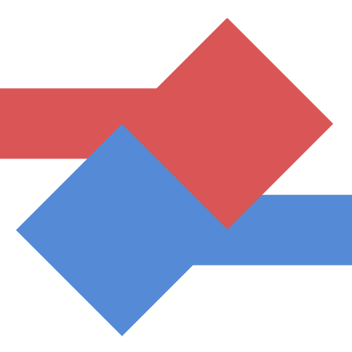
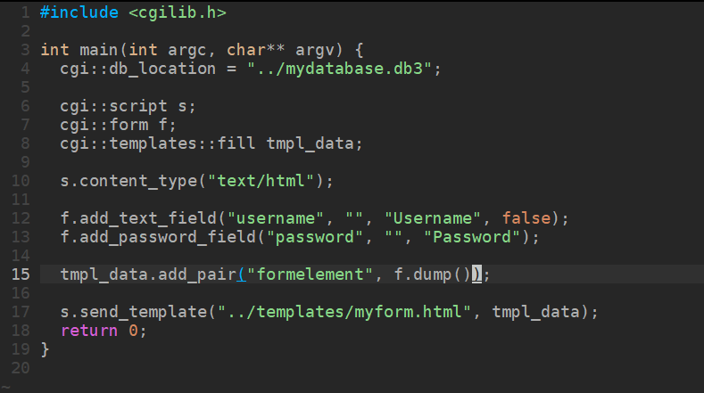

<p align="center">
<!-- ALL-CONTRIBUTORS-BADGE:START - Do not remove or modify this section -->
[](#contributors-)
<!-- ALL-CONTRIBUTORS-BADGE:END -->
  <a href="https://github.com/commsdevcpp/cgiscripting">
    
  </a>

  <h3 align="center">CGI Scripting Library</h3>

  <p align="center">
    A general purpose Common Gateway Interface library for interacting with a CGI environment.
    <br />
    <a href="https://commsdevcpp.github.io/cgiscripting"><strong>Explore the docs »</strong></a>
    <br />
    <br />
    <a href="https://github.com/commsdevcpp/cgiscripting/issues/new?assignees=&labels=bug&template=bug_report.md&title=Untitled+Bug">Report Bug</a>
    ·
    <a href="https://github.com/commsdevcpp/cgiscripting/issues/new?assignees=&labels=feature+request&template=feature_request.md&title=Untitled+Feature+Request">Request Feature</a>
    ·
    <a href="https://github.com/commsdevcpp/cgiscripting/issues/new?assignees=&labels=documentation&template=documentation-request.md&title=Untitled+Documentation+Request">Request Documentation</a>
    ·
    <a href="https://github.com/commsdevcpp/cgiscripting/issues/new?assignees=&labels=question&template=question.md&title=Untitled+Question">Ask Question</a>
    ·
    <a href="#contributing">Contribute</a>
    <br/>
    <br/>
    <a href="https://github.com/commsdevcpp/cgiscripting/graphs/contributors">
    </a>
    <a href="https://github.com/commsdevcpp/cgiscripting/network/members">
    </a>
    <a href="https://github.com/commsdevcpp/cgiscripting/stargazers">
    </a>
    <a href="https://github.com/commsdevcpp/cgiscripting/issues">
    </a>
    <a href="https://github.com/commsdevcpp/cgiscripting/blob/main/LICENSE">
    </a>
  </p>
</p>

## Table of Contents

* [About the Project](#about-the-project)
* [Getting Started](#getting-started)
  * [Prerequisites](#prerequisites)
  * [Installation](#installation)
* [Usage](#usage)
  * [Hello, world!](#hello-world)
  * [Redirection](#redirection)
* [Roadmap](#roadmap)
* [Contributing](#contributing)
* [License](#license)
* [Contact](#contact)
* [Contributors](#contributors-)

## About The Project

[](https://commsdevcpp.github.io/cgiscripting)

Dynamic content is the one concept that allows so much of the modern web to exist. For example, you wouldn't have access to online accounts, because so many services return different content from what you request if you're not logged in. Online banking, Google, Microsoft, Reddit, Twitter, GitHub, and more all take advantage of the ability to generate dynamic content.

"How do they do it?" you might ask yourself. The answer is simple. *Server-side Scripting*. This is a term that makes many programmers feel uneasy, due to the existance of languages like PHP. Regardless, a server-side script is a file on a server that, instead of being sent out as the content itself, gets run, and the output of the program is what gets sent. The problem, of course, comes with how to communicate with the server to get some important information? How do you get a cookie that the client sent without making your own server and starting from scratch (we ***really*** don't recommend this)? To answer this question, the IETF (Internet Engineering Task Force) published a request for comments (specification) document on a new concept they had been working on, called the Common Gateway Interface.

Obviously, we won't go into detail with what they spec says (read it [here](https://tools.ietf.org/html/rfc3875)), but the simple answer is that the server can start up a program with a special environment called the interface. The server sets up an environment for the program to work in, setting environment variables, and redirecting `stdin` and `stdout` to the necessary locations. The problem is that the fundamentals of the POSIX environment were never meant to carry such information as twelve cookies in one variable, so there are some problems.

To make a long story short, getting all of the information required from this interface is tedious and requires quite a bit of barebones code, which, let's be honest, nobody likes writing. To solve this issue, and offer more functionality without cluttering up your scripts, we've written a C++ library to do this all for you! You can get headers, read metadata about the request, send files, and more!

## Getting Started

To get a local copy up and running follow these simple steps.

### Prerequisites

This library requires that you have the following, or some good replacement for the following.

* Linux (tested on Ubuntu Bionic and Debian)
* C++ version 17
* g++ version 8.3.0
* A CGI compliant webserver capable of running executable files

### Installation

1. Clone this repository
2. Move the header file into `/usr/local/include`
3. Clean up
4. Done! Reference the library like this: `#include <cgilib.h>`

```
# git clone https://github.com/commsdevcpp/cgiscripting.git tmp/cgiscripting
# mv tmp/cgiscripting/cgilib.h /usr/local/include/cgilib.h
# rm -r tmp/cgiscripting
```

## Usage

Here are a list of examples to learn about what this library can do.

### Hello, world!

```cpp
#include <cgilib.h>

int main(int argc, char** argv) {
  cgi::script s;
  s.content_type("text/plain");
  
  s.out << "Hello, world!";
  
  s.send_response();
  return 0;
}
```

### Redirection

```cpp
#include <cgilib.h>

int main(int argc, char** argv) {
  cgi::script s;
  s.redirect("/mydestination");
  return 0;
}
```

_For more examples, please refer to the [Documentation](https://commsdevcpp.github.io/cgiscripting)_

## Roadmap

See the [open issues](https://github.com/commsdevcpp/cgiscripting/issues) for a list of proposed features (and known issues).

## Contributing

Contributions are what make the open source community such an amazing place to learn, inspire, and create. Any contributions you make are **greatly appreciated**.

To contribute to our project, follow these simple steps

1. Fork the Project
2. Create your Feature Branch (`git checkout -b feature/username/mycoolfeature`)
3. Commit your Changes (`git commit`) (It is preferred that you sign the commit, but it is not required)
4. Push to the Branch (`git push origin feature/username/mycoolfeature`)
5. Create an issue (if it doesn't already exist)
6. Open a Pull Request and link the issue ("resolve #3" in the description)

## License

This project is distributed under the Apache 2.0 License. See `LICENSE` for more information.

## Contact

To contact owners about a feature request or bug, make an issue.

**To contact the owners about a security vulnerability, send a message to [cppcgilibsecurity@googlegroups.com](mailto:cppcgilibsecurity@googlegroups.com), and be as descriptive as possible.** Be sure to include your GitHub username or other email contact.

Project Link: [https://github.com/commsdevcpp/cgiscripting](https://github.com/commsdevcpp/cgiscripting)

## Contributors ✨

Thanks goes to these wonderful people ([emoji key](https://allcontributors.org/docs/en/emoji-key)):

<!-- ALL-CONTRIBUTORS-LIST:START - Do not remove or modify this section -->
<!-- prettier-ignore-start -->
<!-- markdownlint-disable -->
<table>
  <tr>
    <td align="center"><a href="https://github.com/nicholasbus"><br /><sub><b>Nicholas</b></sub></a><br /><a href="#maintenance-nicholasbus" title="Maintenance">🚧</a></td>
  </tr>
</table>

<!-- markdownlint-enable -->
<!-- prettier-ignore-end -->
<!-- ALL-CONTRIBUTORS-LIST:END -->

This project follows the [all-contributors](https://github.com/all-contributors/all-contributors) specification. Contributions of any kind welcome!
